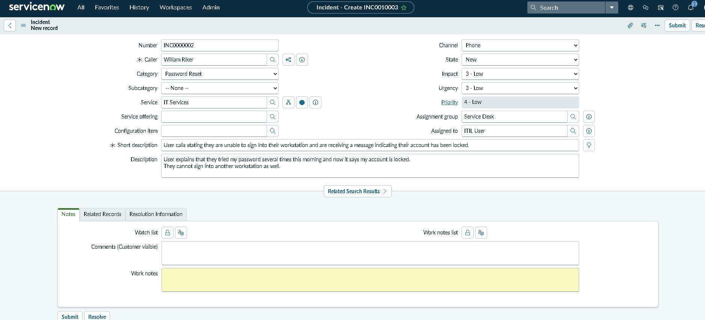
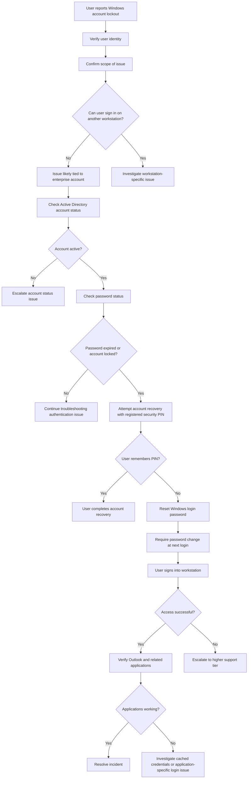

## Current Issue Occurring

User calls stating they are unable to sign into their workstation and are receiving a message indicating their account has been locked.

## User Impact & Identity Verification

In order to establish identity I ask for Location ID, Workstation ID, Employee ID number and Supervisor E-mail.

I would then see the impact the issue is having by asking them when did this incident occur, if the user tried to log in on another workstation?
Is it for their enterprise log in or perhaps a specific application log in without an email maybe using an ID number and passcode. And what exactly are they locked out of.

** User explains that they are locked out of their Windows login. "I tried my password several times this morning and now it says my account is locked. 
I cannot sign into another workstation either."

### Ticket Creation

 

## Troubleshooting Workflow

## Troubleshooting Steps

 

1. Ask the user if they received any notification of a password change requirement if no then step 2. 

2. I would open up active directory and check that the account would still be active in the user groups

3. Click on their account and check if the password is still active or expired.

4. I would then walk the user to click account recovery and enter a personal security pin that has been registered for that user as a company policy, User does not remember PIN

5. If the user does not remember the pin then next step is I would need to reset their password with a mandatory password change at log in. 

## Solutions That Did Not Work

* Account recovery tab under Windows Log In did not work. 

* Switching workstations to log in did not solve the issue.

## Resolution

User is unable to recover account from password lock out after multiple failed attempts. I reset their Windows Log in password with a mandatory password change at log in. 
User was able to enter their system and use all applications that used the same credentials with out issue.

## Related Incidents

None at this time

## Lessons Learned

1.Cached Credentials can continue using old passwords after a password reset and can contribute to future account lockouts.
  By verifying that the user can actively sign in to every application that uses those old credentials and making sure the new ones work, 
  you can avoid a repeat of an account lock out.
