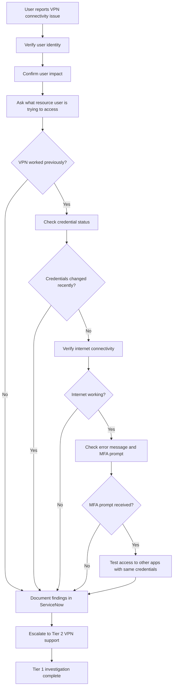

### INC003 - Remote Access VPN Connection

### Current Issue Occurring

User reports that they are not able to connect to Corporate applications using VPN

### User Impact

User reports that they are trying to log into their workstation from home via remote VPN but is not able to log in. 
User stated they need to access their E-mail to send out confidential files that is time sensitive.

### Identity Verification

Verify User Identity by having user confirm
1.Employee I.D number,
2.Manager Approval, 
3.MFA Security questions.

## Troubleshooting Steps

1. What are you trying to connect to?

2. When was the last time you were able to log into your VPN succesfully?

3. Are your credentials the same or has it been changed or did you receive any notification to change them.

4. Do you know if you are the only one experiecing this issue ?

5. Are you able to use the internet normally to access websites like google.

6. Are you receiving any error messages?

7. Do you have MFA, what type and are you receiving the notification to log in through it.

8. Is the User able to log into any other application that uses those same credentials?

## Workflow

###Resolution

1.Ticket will be escalated to tier 2 technician in order to investigate VPN further and find a solution, Unable to identify cause of VPN connection issue. 

**What has been confirmed**

1.Identity verified.
2.User reports VPN connectivity failure.
3.Internet connectivity confirmed.
4.User able to access external websites.
5.VPN was functioning previously on last log in (yesterday).
6.No recent credential changes reported.
7.User not receiving MFA prompt during login attempt.
8.Issue appears isolated to a single user.

Related Incidents

None at this time

##Lessons Learned

One person can not solve every issue, communication is key to get the right level of help to solve the problem.
